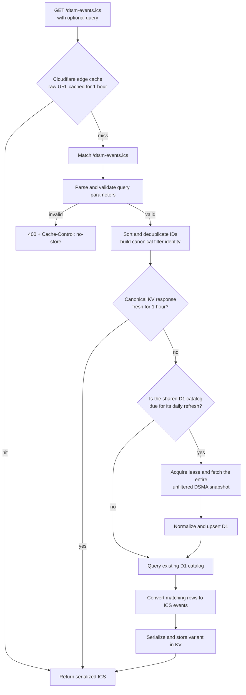

# DTSM event feed request flow

The difficult part of this calendar happens before filtering: one unfiltered
DSMA snapshot is normalized into events, venues, organizers, categories, and
their relationships in D1. A filtered calendar URL is therefore only a
validated view over that shared catalog.

## One request from URL to calendar



Cloudflare keys its edge cache by the raw path and query string. The Worker
normalizes equivalent filters again for KV, so different URL spellings of the
same selection share the retained response.

## URL contract

The feed accepts each of these plural parameters at most once:

- `venues`
- `organizers`
- `categories`

Each value is a comma-separated list of positive integer source IDs.

```text
/dtsm-events.ics
/dtsm-events.ics?venues=5507,4211
/dtsm-events.ics?organizers=6047
/dtsm-events.ics?venues=5507,4211&categories=15
```

No query preserves the original view:

```ts
{
  venueIds: [1201, 1249, 1260, 1328, 3999, 1137]
}
```

Once any filter is supplied, omitted groups are unrestricted. IDs within one
group are ORed. Supplied groups are ANDed. For example:

```text
?venues=5507,4211&categories=15

means

(venue is 5507 OR venue is 4211)
AND
(category is 15)
```

A well-formed unknown ID is a valid filter and can produce an empty calendar.
Unknown parameter names, repeated parameters, empty lists, and invalid IDs
return HTTP 400 with `Cache-Control: no-store`.

## Parsing and cache identity

[`query.ts`](query.ts) owns the public query interpretation. It trims values,
validates positive base-10 safe integers, removes duplicate IDs, sorts them,
and emits parameters in venue, organizer, category order.

These URLs therefore have the same canonical identity:

```text
?categories=15&venues=5507,4211,5507
?venues=4211,5507&categories=15
```

The canonical string is SHA-256 hashed into a bounded KV key. The default feed
keeps the stable `dtsm-events.ics` key indefinitely. Custom variants are fresh
for one hour and expire after 30 inactive days. An active subscription rebuilds
hourly and renews its variant.

## Source freshness is separate

The two clocks serve different jobs:

```text
DSMA -> normalized D1 catalog: at most once every 24 hours
D1 -> one serialized ICS variant: at most once every hour
```

[`index.ts`](index.ts) checks the shared D1 sync state after a response-cache
miss. If the catalog is current, the request only reads D1. If it is due, one
request acquires the five-minute lease, fetches every unfiltered DSMA page, and
persists the snapshot before reading. Query filters are never sent upstream.

If an upstream refresh fails after an earlier success, the request reads the
stored catalog with the same filter. If D1 itself fails, the response-cache
wrapper can serve that filter variant's last retained ICS body.

## Database filtering

[`repository.ts`](repository.ts) starts every read with non-withdrawn events.
The effective SQL for a venue and category request is approximately:

```sql
SELECT e.*, v.*
FROM dtsm_events AS e
LEFT JOIN dtsm_venues AS v ON v.id = e.venue_id
WHERE e.withdrawn_at IS NULL
  AND e.venue_id IN (
    SELECT value FROM json_each(?)
  )
  AND EXISTS (
    SELECT 1
    FROM dtsm_event_categories AS ec
    WHERE ec.event_id = e.id
      AND ec.category_id IN (
        SELECT value FROM json_each(?)
      )
  )
ORDER BY e.start_local, e.end_local, e.id;
```

For `?venues=5507,4211&categories=15`, Drizzle binds the JSON arrays
`[4211,5507]` and `[15]`. The `IN` predicate provides OR within a group. The
top-level conditions provide AND across groups. Organizer filtering uses the
same correlated `EXISTS` shape against `dtsm_event_organizers`.

Using `json_each(?)` keeps an entire ID set in one D1 binding. After the first
query identifies events, two relationship queries load their ordered organizer
and category names. [`events.ts`](events.ts) converts those stored rows to event
attributes, and the shared [Worker pipeline](../../index.ts) serializes and
caches the complete calendar.

## Implementation map

- [`query.ts`](query.ts): URL validation, normalization, KV identity, and
  custom-variant retention.
- [`index.ts`](index.ts): response freshness, daily sync gate, lease, fallback,
  and filter handoff.
- [`repository.ts`](repository.ts): normalized storage and SQL filtering.
- [`events.ts`](events.ts): stored rows to iCalendar event attributes.
- [`../../index.ts`](../../index.ts): routing, common serialization, HTTP
  response behavior, and error mapping.
- [`../../lib/response-cache.ts`](../../lib/response-cache.ts): fresh reads,
  writes, expiration, and stale outage fallback.
